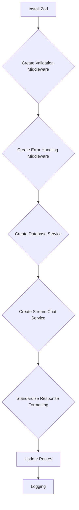

# Refactoring Plan

The goal is to reduce code duplication and improve maintainability by extracting reusable functions and middleware.

1.  **Install Zod:** Add `zod` as a project dependency.
2.  **Create Validation Middleware:**
    - Create a `middleware` directory in `src`.
    - Create a `validation.ts` file in `src/middleware`.
    - Implement a generic validation middleware function that takes a Zod schema as input and validates the request body against it.
    - Apply the validation middleware to each route, defining the specific Zod schema for each route's input data.
3.  **Create Error Handling Middleware:**
    - Create an `error.ts` file in `src/middleware`.
    - Implement an error handling middleware function that logs errors to a file and returns specific error codes based on the error type.
    - Configure the error handling middleware to be used after all routes.
4.  **Create a Database Service:**
    - Create a `services` directory in `src`.
    - Create a `db.ts` file in `src/services`.
    - Extract the database query logic (e.g., checking for existing users) into reusable functions in the `db.ts` file.
    - Import and use these functions in the routes.
5.  **Create a Stream Chat Service:**
    - Create a `stream.ts` file in `src/services`.
    - Extract the Stream Chat client interaction logic into reusable functions in the `stream.ts` file.
    - Import and use these functions in the routes.
6.  **Standardize Response Formatting:**
    - Create a `utils` directory in `src`.
    - Create a `response.ts` file in `src/utils`.
    - Implement a helper function for formatting responses as JSON objects with a status code.
    - Use this helper function in all routes.
7.  **Update Routes:**
    - Update the route files to use the new middleware, services, and helper functions.
    - Remove duplicated code and logic.
    - Ensure that all routes are properly validated and handle errors gracefully.
8.  **Logging:**
    - Implement logging to a file using a library like Winston or Bunyan.
    - Include relevant information in the logs, such as timestamps, error messages, and request details.

Here's a Mermaid diagram of the plan:

